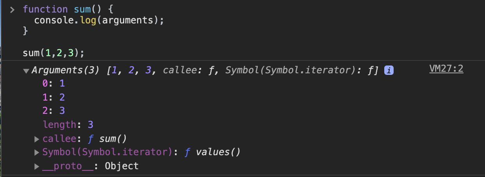

# ES6 syntax

Actually we've learned of them like "arrow function", "string template literal" and "default parameters". Now let's see more cool features in ES6.

## Default parameters

we can give "default parameter" to our function

```javascript
function sum(a, b = 1) {
  return a + b;
}

// if we do not provide value for b when execute
// it will b = 1 for parameter
sum(5, 8); // 13
sum(5); // 6, b = 1

const greeting = (name = 'Tim') => {
  return `YOOO! ${name}`;
};

greeting(); // YOOO! Tim
greeting('Mesut'); // YOOO! Mesut
```

one thing you need to aware of is the order of default parameters when execute is matter.

```javascript
function mul(a = 2, b) {
  return a * b;
}

mul(2); // NaN Does not work
```

## Spread syntax

A description from MDN

> Spread syntax allows an iterable such as an array expression or string to be expanded in places where zero or more arguments (for function calls) or elements (for array literals) are expected, or an object expression to be expanded in places where zero or more key-value pairs (for object literals) are expected.

Hmmmmmmmmmmmmmm...:thinking: I don't get it. Let's see some example code

Basically, there are 3 scenarios consider to use spread syntax:

1. Function call
2. Array literal
3. Object literal

### Spread syntax for Function calls

> Expands an iterable (array, string, etc.) into a list of arguments

syntax is:

```javascript
myFunction(...iterable);
```

```javascript
const nums = [9, 3, 2, 8];
Math.max(nums); // NaN

// Use spread
Math.max(...nums); // 9

// think of it as
Math.max(9, 3, 2, 8); // so we'll get 9
```

_We are spreading this iterable into individual arguments._

let's see more examples

```javascript
const giveMeFour = (a, b, c, d) => {
    console.log("a", a);
    console.log("b", b);
    console.log("c", c);
    console.log("d", d);
}

const colors = ["red", "green", "blue", "yellow"];

// if we pass array of colors into function
giveMeFour(colors);

// then we'll get something like this
a [ 'red', 'green', 'blue', 'yellow' ]
b undefined
c undefined
d undefined

// but spread arguments
giveMeFour(...colors);

a red
b green
c blue
d yellow
```

we also can use spread with string

```javascript
const str = "GOAT";
giveMeFour(...str);
a G
b O
c A
d T
```

we're now spreading that entire array into separate arguments. Pretty cool though.

### Spread syntax for Array literals

> Create a new array using existing array. Spreads the elements from one array into a new array.

```javascript
const num1 = [1, 2, 3];
const num2 = [4, 5, 6];

const num3 = [...num1, ...num2]; // [ 1, 2, 3, 4, 5, 6 ]

// Even re-order
const num4 = [...num2, ...num1]; // [6,5,4,3,2,1,]

// we also can add new elements combined with existing
const num5 = [...num1, ...num2, 66, 77, 88, 99]; // [ 1, 2, 3, 4, 5, 6, 66, 77, 88, 99 ]
```

pretty like `Array.concat` but shorter syntax, easier to see and re-order as you like. And we can add elements wherever we want to.

How about cloning an array? Yes, also can do with spread syntax.

```javascript
const myFavLang = ['javascript', 'python', 'go', 'elixir', 'rust', 'C++'];

const clone = [...myFavLang]; // [ 'javascript', 'python', 'go', 'elixir', 'rust', 'C++' ]
```

and we'll get new array with new reference

```javascript
clone === myFavLang; // false
```

even split strings with spread syntax!

```javascript
// old fashion
'ARSENAL'.split(''); //['A', 'R', 'S', 'E', 'N', 'A','L']

// with spread syntax
[...'ARSENAL']; // ['A', 'R', 'S', 'E', 'N', 'A','L']
```

### Spread in Object literals

> Copies properties from one object into another object literal. Or we can create combination of objects.

```javascript
// clone object
const user = {
  name: 'Teerapat',
  age: 33,
  isAdmin: true
};

const cloneUser = { ...user }; // { name: 'Teerapat', age: 33, isAdmin: true } and yes with different reference.

// or copy from the existing one and add more properties
const feline = {
  legs: 4,
  family: 'Felidae'
};

const houseCat = {
  ...feline,
  isGrumpy: true,
  personality: 'Unpredictable'
};
// {
//   legs: 4,
//   family: 'Felidae',
//   isGrumpy: true,
//   personality: 'Unpredictable'
// }
```

what if we try to use wih objects that have same keys? well, order is matter.

```javascript
const obj1 = {
  a: 1,
  b: 2
};

const obj2 = {
  b: 5,
  d: 4
};

const obj3 = {
  ...obj1,
  ...obj2
};
// obj3 is { a: 1, b: 5, d: 4 } the last one will overwite. if we switch obj2 first, b = 2
```

how'bout spread array into object literal?

```javascript
const numObj = {...[4,5,6,7]}; // we'll get object back with indecies
{
    '0': 4,
    '1': 5,
    '2': 6,
    '3': 7
}
```

## Introduction to the arguments object (Not new)

1. It's an array-like object

   - Has a length property
   - Does not have array methods like push/pop

2. Contains all arguments passed to the function

3. Not avalable inside of arrow functions

```javascript
function sum() {
  console.log(arguments);
}

sum(1, 2, 3);
```

let's what we get


if we try to `sum` all the arguments

```javascript
function sum() {
  return arguments.reduce((total, current) => {
    return total + current;
  });
}
// Uncaught TypeError: arguments.reduce is not a function
```

as mentioned above, `arguments` is not array. It just array-like object. and it does not work with arrow function

```javascript
const multiply = () => {
  console.log(arguments);
};

multiply(2, 3); // Uncaught ReferenceError: arguments is not defined
```

## Rest parameters

Collect all remaining arguments into an "actual" array.

```javascript
function sum(...nums) {
  console.log(nums);
}

sum(1, 2, 3, 4); // [ 1, 2, 3, 4 ]
```

It's actual array, so we can use array methods like we did before

```javascript
function sum(...nums) {
  return nums.reduce((total, current) => {
    return total + current;
  });
}

sum(1, 2, 3, 4); // 10
```

let's see example about how rest collects the remaining arguments

```javascript
function getFullname(first, last, ...titles){
  console.log('first is ',first)
  console.log('last is ',last)
  console.log('title is ',titles)
}

getFullname('Roy', 'Jones', 'Jr.', 'III');

first is  Roy
last is  Jones
title is  [ 'Jr.', 'III' ]
```

and it does work with arrow function

```javascript
const multiply = (...nums) => {
  return nums.reduce((total, current) => {
    return total * current;
  });
};

multiply(2, 3, 4); // 24
```

## Destructuring

A short, clean syntax to "unpack" values from array or properties from objects into distinct variables

### Destructuring Array

```javascript
const RHCP = [
  'Anthony Kiedis',
  'Flea',
  'John Frusciante',
  'Chad Smith',
  'Josh Klinghoffer',
  'Dave Navaro'
];

// this is how we unpack to individual variables
const [vocalist, bassist, guitarist, drummer] = RHCP;
// vocalist -> Anthony Kiedis
// bassist -> Flea
// guitarist -> John Frusciante
// drummer -> Chad Smith
```

and order is matter, if we swap the position, value alson change.

```javascript
const [bassist, drummer] = RHCP;
// bassist -> Anthony Kiedis
// drummer -> Flea
```

even we can skip the variable if we want to.

```javascript
const [vocalist, , , drummer] = RHCP;
// bassist -> Anthony Kiedis
// drummer -> Chad Smith
// Flea and John will be skipped
```

and combined with `...` rest syntax

```javascript
const [vocalist, bassist, guitarist, drummer, ...[formerMembers]] = RHCP;
// formerMembers = ['Josh Klinghoffer','Dave Navaro']
```

### Destructuring Object

If we apply destructuring syntax to an object, we often named variables with the key of the object. The syntax is:

```javascript
const { key } = Object;
```

let's see some examples.

```javascript
const RHCP = {
  name: 'Red Hot Chili Peppers',
  style: 'Funk Rock',
  yearsActive: 27,
  members: ['Anthony Kiedis', 'Flea', 'John Frusciante', 'Chad Smith']
};

const { name, style, yearsActive, members } = RHCP;
```

what if we name variable that doesn't exist in the key of the object

```javascript
const { name, style, yearsActive, discography } = RHCP; // discography is undefined
```

if we need to use new variable name, we need to do like this:

```javascript
const { yearActive: years } = RHCP; // it will make variable name 'years' with value of yearActive (27)
```

also we can combine with `rest` operator just like we did with array.

```javascript
const { name, style, ...others } = RHCP; // we get another object back like so
others
{
  yearsActive: 27,
  members: [ 'Anthony Kiedis', 'Flea', 'John Frusciante', 'Chad Smith' ]
}
```

### Destructuring parameters

One more place you'll often see destructuring used which is inside of a `function` definition where the parameters are listed. We put it inside the parentheses of a function definition what this will do is **"extract or unpack"** values from the arguments passed in.

```javascript
const fullName = ({ first, last }) => {
  return `${first} ${last}`;
};

const runner = {
  first: 'Eliud',
  last: 'Kipchoge',
  country: 'Kenya'
};

fullName(runner); // 'Eliud Kipchoge'
```

we also can do with array arguments

```javascript
const getMembers = ([vocalist, bassist, guitarist, drummer]) => {
  return `RHCP is a super cool rock band that have ${vocalist} as a vocalist, bassist ${bassist}, ${guitarist} as guitarist and ${drummer} as a drummer.`;
};

const RHCP = ['Anthony Kiedis', 'Flea', 'John Frusciante', 'Chad Smith'];

getMembers(RCHP); // 'RHCP is a super cool rock band that have Anthony Kiedis as a vocalist, bassist Flea, John Frusciante as guitarist and Chad Smith as a drummer.'
```
