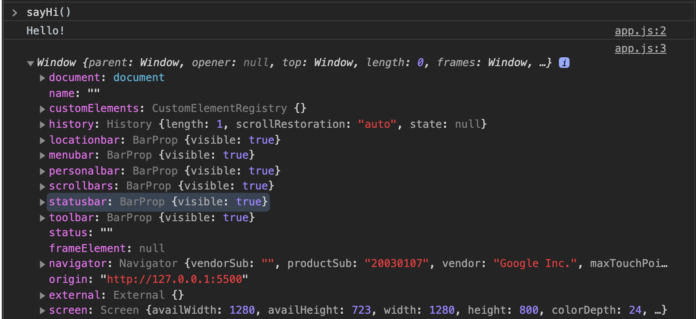
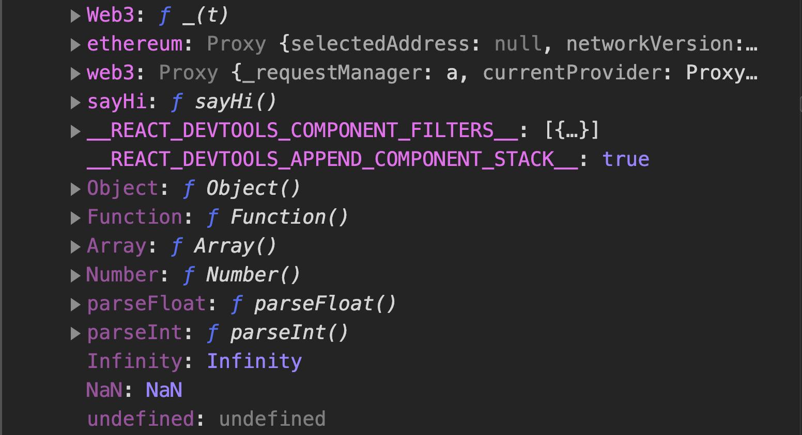
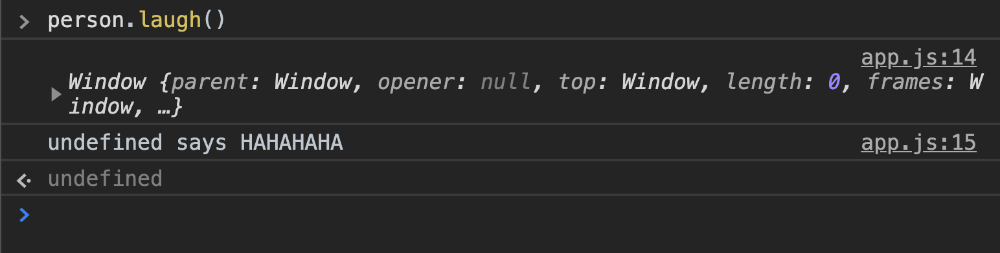

# Object Method

We can add functions as properties on objects. We call them "methods"!

```javascript
const mathOps = {
    add: function(a, b) {
        return a + b;
    },
    subtract: function(a, b) {
        return a - b;
    },
    multiply: function(a, b) {
        return a * b;
    },
    divide: function(a, b) {
        return a / b;
    }
}

math.add(5,6); // 11, same idea as Math.add (build-in function)
```

we can write them in the short way, no need `key` : `value`

```javascript
const mathOps = {
    add(a, b) {
        return a + b;
    },
    subtract(a, b) {
        return a - b;
    },
    multiply(a, b) {
        return a * b;
    },
    divide(a, b) {
        return a / b;
    }
}
```

## The `this` keyword

To access the object, a method can use the `this` keyword, well what (the heck) is `this`?

> Think of it as a reference to the current execution scope. It is going to give you an object back.

for example:

```javascript
function sayHi() {
    console.log("Hello!");
    console.log(this);
}
```

let's see in the console



we get "Hello!" back with "window" object which is contained many properties. "window" is a global scope in the browser. And if scroll down a bit you will see our method "sayHi"



So, `this` is a reference an object and that object represents current execution scope which can change and we'll see shortly.

## Using `this` in method

let's say we have an object

```javascript
const person = {
    firstname: "Teerapat",
    lastname: "Prommarak",
    nickname: "X",
    getFullname() {
        // let's logging `this` first,
        console.log(this)
    }
}

person.getFullname(); // we get our object back!
{
  firstname: 'Teerapat',
  lastname: 'Prommarak',
  nickname: 'X',
  getFullname: [Function: getFullname]
}
```

as you can see, value of `this` is different, inside the method `this` is refer to object itself and it allow us to reference this properties.

```javascript
const person = {
    firstname: "Teerapat",
    lastname: "Prommarak",
    nickname: "X",
    getFullname() {
        console.log(`${this.firstname} ${this.lastname}`)
    }
}

person.getFullname(); // Teerapat Prommarak
```

what if we change the properties and call `getFullname` again? That changes reflected

```javascript
person.firstname = "Bryant";
person.getFullname(); // Bryant Prommarak
```

so, `this` is looking up the value of `firstname` on the current execution scope which is what this refers to.

We could also add another method to the object and call a different method using `this` keyword.

```javascript
const person = {
    firstname: "Teerapat",
    lastname: "Prommarak",
    nickname: "X",
    getFullname() {
       return `${this.firstname} ${this.lastname}`
    },
    getBio() {
        console.log(`${this.getFullname()} is a person who is studying in web development`)
    }
}

person.getBio(); // Teerapat Prommarak is a person who is studying in web development
```

## Arrow function with `this` keyword

Arrow functions are special, they don't have their own `this`. If we reference `this` inside the function, we'll get something different.

```javascript
const person = {
    firstname: "Teerapat",
    lastname: "Prommarak",
    nickname: "X",
    getFullname() {
       return `${this.firstname} ${this.lastname}`
    },
    getBio() {
        console.log(`${this.getFullname()} is a person who is studying in web development`)
    },
    laugh: () => {
        console.log(`${this.nickname} says HAHAHAHA`)
    }
}

person.laugh(); // undefined says HAHAHAHA
```

if we log `this` and check

```javascript
const person = {
    laugh: () => {
        console.log(this)
        console.log(`${this.nickname} says HAHAHAHA`)
    }
}


```

`this` is reference to window



to recap value of `this` is depends on the invocation context the function it is used in. And arrow function have no `this`
