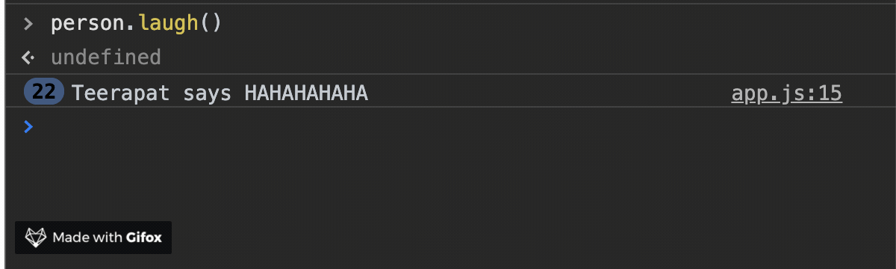

# Object Method

We can add functions as properties on objects. We call them "methods"!

```javascript
const mathOps = {
  add: function(a, b) {
    return a + b;
  },
  subtract: function(a, b) {
    return a - b;
  },
  multiply: function(a, b) {
    return a * b;
  },
  divide: function(a, b) {
    return a / b;
  }
};

math.add(5, 6); // 11, same idea as Math.add (build-in function)
```

we can write them in the short way, no need `key` : `value`

```javascript
const mathOps = {
  add(a, b) {
    return a + b;
  },
  subtract(a, b) {
    return a - b;
  },
  multiply(a, b) {
    return a * b;
  },
  divide(a, b) {
    return a / b;
  }
};
```

## The `this` keyword

To access the object, a method can use the `this` keyword, well what (the heck) is `this`?

> Think of it as a reference to the current execution scope. It is going to give you an object back.

for example:

```javascript
function sayHi() {
  console.log('Hello!');
  console.log(this);
}
```

let's see in the console


we get "Hello!" back with "window" object which is contained many properties. "window" is a global scope in the browser. And if scroll down a bit you will see our method "sayHi"


So, `this` is a reference an object and that object represents current execution scope which can change and we'll see shortly.

## Using `this` in method

let's say we have an object

```javascript
const person = {
    firstname: "Teerapat",
    lastname: "Prommarak",
    nickname: "X",
    getFullname() {
        // let's logging `this` first,
        console.log(this)
    }
}

person.getFullname(); // we get our object back!
{
  firstname: 'Teerapat',
  lastname: 'Prommarak',
  nickname: 'X',
  getFullname: [Function: getFullname]
}
```

as you can see, value of `this` is different, inside the method `this` is refer to object itself and it allow us to reference this properties.

```javascript
const person = {
  firstname: 'Teerapat',
  lastname: 'Prommarak',
  nickname: 'X',
  getFullname() {
    console.log(`${this.firstname} ${this.lastname}`);
  }
};

person.getFullname(); // Teerapat Prommarak
```

what if we change the properties and call `getFullname` again? That changes reflected

```javascript
person.firstname = 'Bryant';
person.getFullname(); // Bryant Prommarak
```

so, `this` is looking up the value of `firstname` on the current execution scope which is what this refers to.

We could also add another method to the object and call a different method using `this` keyword.

```javascript
const person = {
  firstname: 'Teerapat',
  lastname: 'Prommarak',
  nickname: 'X',
  getFullname() {
    return `${this.firstname} ${this.lastname}`;
  },
  getBio() {
    console.log(
      `${this.getFullname()} is a person who is studying in web development`
    );
  }
};

person.getBio(); // Teerapat Prommarak is a person who is studying in web development
```

## Arrow function with `this` keyword

Arrow functions are special, they don't have their own `this`. If we reference `this` inside the function, we'll get something different.

```javascript
const person = {
  firstname: 'Teerapat',
  lastname: 'Prommarak',
  nickname: 'X',
  getFullname() {
    return `${this.firstname} ${this.lastname}`;
  },
  getBio() {
    console.log(
      `${this.getFullname()} is a person who is studying in web development`
    );
  },
  laugh: () => {
    console.log(`${this.nickname} says HAHAHAHA`);
  }
};

person.laugh(); // undefined says HAHAHAHA
```

if we log `this` and check

```javascript
const person = {
  laugh: () => {
    console.log(this);
    console.log(`${this.nickname} says HAHAHAHA`);
  }
};
```

`this` is reference to window


to recap value of `this` is depends on the invocation context the function it is used in. And arrow function have no `this`

However, arrow function might useful in some particular cases. What if I want to call `laugh` method every 3 seconds.

```javascript
const person = {
  firstname: 'Teerapat',
  lastname: 'Prommarak',
  nickname: 'X',
  getFullname() {
    return `${this.firstname} ${this.lastname}`;
  },
  getBio() {
    console.log(
      `${this.getFullname()} is a person who is studying in web development`
    );
  },
  laugh() {
    setInterval(() => {
      console.log(`${this.firstname} says HAHAHAHAHA`);
    }, 3000);
  }
};

person.laugh(); // `this` keyword inside setInterval callback function is reference to Object person and when you `laugh` method, it will print HAHAHAHAHA for every 3 seconds
```



## Object constructor function

Constructor functions technically are regular functions. There are two conventions though:

1. They are named with capital letter first.
2. They should be executed only with `new` operator.

For example

```javascript
function User(name, age, isAdmin) {
  this.name = name;
  this.age = age;
  this.isAdmin = isAdmin;
}

// create a new user by using `new` operator
const user1 = new User('David', 30, true);
console.log(user1); // User { name: 'David', age: 30, isAdmin: true }

const user2 = new User('Peter', 25, false);
console.log(user2); // User { name: 'Peter', age: 25, isAdmin: false }
```

As you can see, we can easily create a new user by using constructor function. That’s the main purpose of constructors – **to implement reusable object creation code.**

### Return from constructors

Normally, constructor does not `return` statement. Result automatically returns as `this`. But if we provide `return` statement, then rule is:

1. If we `return` an object, then the object is returned instead of `this`.
2. If we `return` a primitive, it’s ignored.

here is what happens behind the scenes

```javascript
function User(name, age, isAdmin) {
  // this = {};
  this.name = name;
  this.age = age;
  this.isAdmin = isAdmin;
  // return this;
}
```

what if we return an object?

```javascript
function BigUser() {
  this.name = 'John';
  return { name: 'Godzilla' }; // <-- returns this object
}

console.log(new BigUser().name); // Godzilla

function SmallUser() {
  this.name = 'John';
  return; // <-- actually it returns `this` (object that created)
}

console.log(new SmallUser().name); // John
```

### Methods in constructors

```javascript
function User(name, age, isAdmin) {
  this.name = name;
  this.age = age;
  this.isAdmin = isAdmin;

  this.greeting = function() {
    console.log(`Hello, my name is ${this.name} I'm ${this.age} years old`);
  };
}

const user3 = new User('Mesut', 31, false);
user3.greeting(); // => Hello, my name is Mesut I'm 31 years old
```
