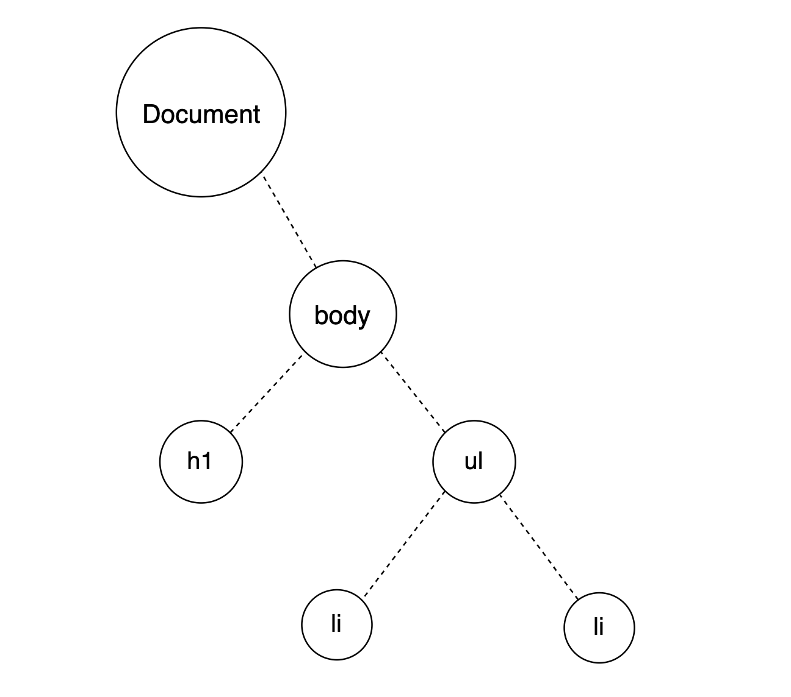
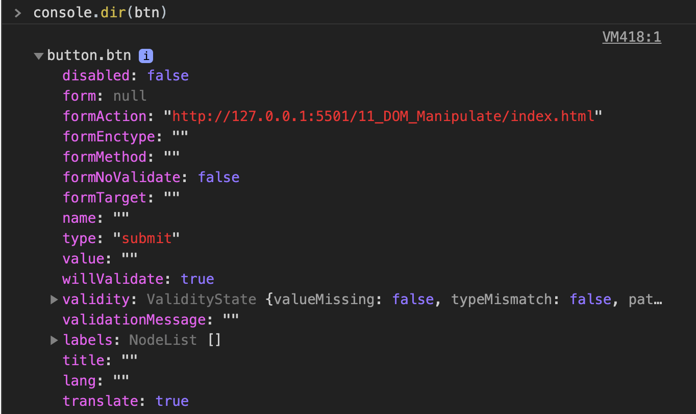
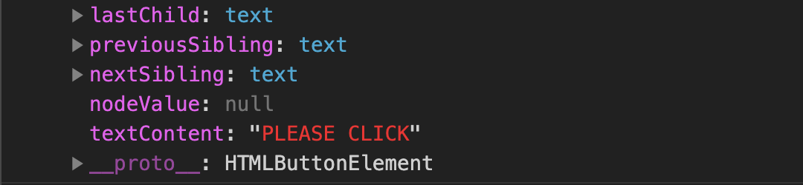
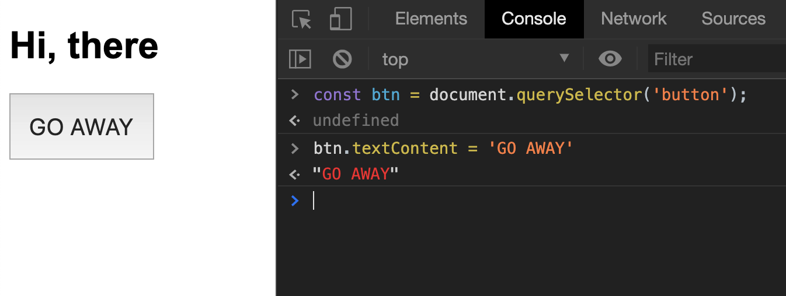
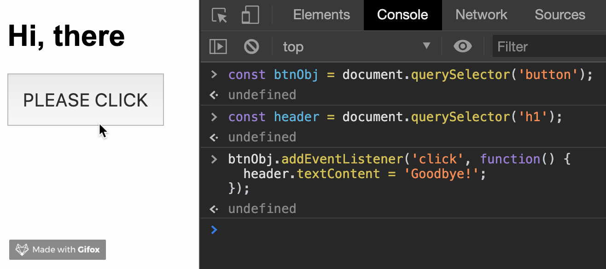

# Document Object Model (DOM)

The definition from [MDN](https://developer.mozilla.org/en-US/docs/Glossary/DOM) is:

> The DOM (Document Object Model) is an API that represents and interacts with any HTML or XML document. The DOM is a document model loaded in the browser and representing the document as a node tree, where each node represents part of the document (e.g. an element, text string, or comment).

hmmmmmmm... come on, just explain like I'm 5.

- The DOM is a JavaScript representation of a webpage.
- It's your javascript "window" into the content of a webpage.
- It's just a bunch of objects that you can **interact** with via JavaScript.

Think like an object that we can manipulate them. We can change values of form, add animations, change style of anything or even listen to events for clicks or drag or hover or any sort of events that a user could trigger.

here what's browser see:

```html
<body>
  <h1>Hello World</h1>
  <ul>
    <li>Sleep</li>
    <li>Coding</li>
  </ul>
</body>
```



The browser will read this in which on its own doesn't mean anything it's just text its text content but at the same time, it creates a virtual representation a javascript object of `<h1>`, `<ul>` and 2 `<li>` respectively. Each one of these circles is an "object".

So, objects have a bunch of different properties. The simplest one is a text inside the element. There are many different properties that we can manipulate it, also update it or even delete it. All of that is done through javascript.

let's say, I have html page with some elements like this:


let's write some javascript code in the browser console

```javascript
const btnObj = document.querySelector('button');
```

and if check `btnObj` variable in the console, we'll get something like this:

```html
<button class="btn">PLEASE CLICK</button>
```

you might think that not look like an object at all, but if you `console.dir(btnObj)` in the console, you will get this:



It's just a javascript object! If you scroll down a little bit, you'll see property `textContent`. and if you remember we can access to properties of the object by using dot notation. Then we can change properties of `btnObj` just like this:



```javascript
btn.textContent = 'GO AWAY!';
```



So when we change a style, change the text or new elements we do it through JavaScript objects and then the browser knows about it. The browser knows that something just changed, browser need to update it for the user so that we can see that change happen.

let's see example about event:

```javascript
const header = document.querySelector('h1');
btnObj.addEventListener('click', function() {
  header.textContent = 'Goodbye!';
});
```



As you can see, we can manipulate anything we want to with javascript. The DOM, document object model is just a bunch of JavaScript objects with so many methods and properties. It's all turned into a javascript representation of objects that we can use we can interact with.
