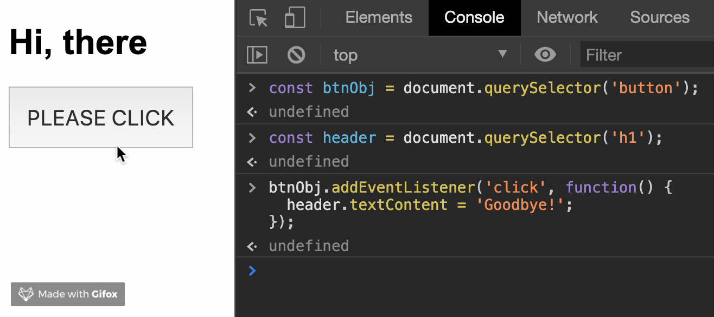

# Document Object Model (DOM)

The definition from [MDN](https://developer.mozilla.org/en-US/docs/Glossary/DOM) is:

> The DOM (Document Object Model) is an API that represents and interacts with any HTML or XML document. The DOM is a document model loaded in the browser and representing the document as a node tree, where each node represents part of the document (e.g. an element, text string, or comment).

hmmmmmmm... come on, just explain like I'm 5.

- The DOM is a JavaScript representation of a webpage.
- It's your javascript "window" into the content of a webpage.
- It's just a bunch of objects that you can **interact** with via JavaScript.

Think like an object that we can manipulate them. We can change values of form, add animations, change style of anything or even listen to events for clicks or drag or hover or any sort of events that a user could trigger.

## The taste of the DOM

```html
<body>
  <h1>Hello World</h1>
  <ul>
    <li>Sleep</li>
    <li>Coding</li>
  </ul>
</body>
```


The browser will read this in which on its own doesn't mean anything it's just text its text content but at the same time, it creates a virtual representation a javascript object of `<h1>`, `<ul>` and 2 `<li>` respectively. Each one of these circles is an "object".

So, objects have a bunch of different properties. The simplest one is a text inside the element. There are many different properties that we can manipulate it, also update it or even delete it. All of that is done through javascript.

let's say, I have html page with some elements like this:


let's write some javascript code in the browser console

```javascript
const btnObj = document.querySelector('button');
```

and if check `btnObj` variable in the console, we'll get something like this:

```html
<button class="btn">PLEASE CLICK</button>
```

you might think that not look like an object at all, but if you `console.dir(btnObj)` in the console, you will get this:


It's just a javascript object! If you scroll down a little bit, you'll see property `textContent`. and if you remember we can access to properties of the object by using dot notation. Then we can change properties of `btnObj` just like this:


```javascript
btn.textContent = 'GO AWAY!';
```


So when we change a style, change the text or new elements we do it through JavaScript objects and then the browser knows about it. The browser knows that something just changed, browser need to update it for the user so that we can see that change happen.

let's see example about event:

```javascript
const header = document.querySelector('h1');
btnObj.addEventListener('click', function() {
  header.textContent = 'Goodbye!';
});
```



As you can see, we can manipulate anything we want to with javascript. The DOM, document object model is just a bunch of JavaScript objects with so many methods and properties. It's all turned into a javascript representation of objects that we can use we can interact with.

## The Document Object

The document object is our entry point into the world of the DOM, which is **The DOM Tree** [(see here)](https://github.com/xeusteerapat/javascript-refresher/tree/master/11_DOM_Manipulate#the-taste-of-the-dom). It contains representation of all the content on the webpage, plus many many useful methods and properties.

```javascript
console.dir(document);
```

tons of objects inside document


you don't need to know every property inside the document object, next section we'll get to know the majority method that we usually use for manipulating elements inside the browser.

## Selecting methods

The most important methods that have to do with selecting so selecting is a really important part of the DOM manipulation process. We select an element or multiple elements then do something with them. The different ways to select is using `document` methods, here are examples:

### `getElementById`

It takes an I.D. and it finds the matching element that contains or that has that I.D. on it and it returns that object.

```javascript
document.getElementById('id');
```

here I have `<p>` with `id='content'` then write this code to the browser console

```javascript
document.getElementById('iceland');
```

then see what returns


and if we save to the variable and check with `console.dir`

```javascript
const img = document.getElementById('iceland');
console.dir(img);
```

then we'll get bunch of properties back.


many many properties we can manipulate it such as `src`, `width`, `height` many and many useful methods. If there is a match and only if there is a match for that I.D. we get that element back as an object. If we pass in an invalid I.D. or something that's not on the page, we'll get `null`

### `getElementByTagName`

pretty similar to `getElementById` but we select by a type of element.

```javascript
document.getElementByTagName('input');
```

here is what we get back:


It called **HTMLCollection** It look likes an array, but it's not. We can do some array-ish with this collection. If we try to access it with array index:


So, it's just array-like object, then we can turn them into array by using `spread` syntax

```javascript
const arrInputs = [...inputs];
console.log(arrInputs); // [input, input, input]
```

How 'bout loop over the array:

```javascript
arrInputs.forEach(item => console.log(item.value));

// here is what we get
Teerapat; // value from 1st input
AsenalIsTheBest; // value from 2nd input
// no value from 3rd input
```

because we didn't set the value of button, so we're not get any value back from the last input element.
