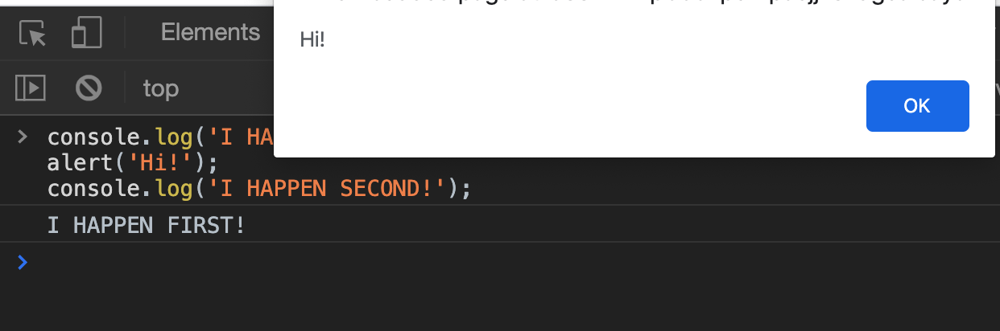
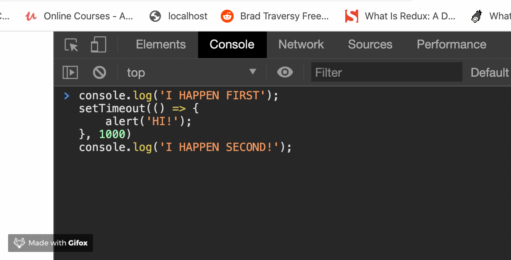
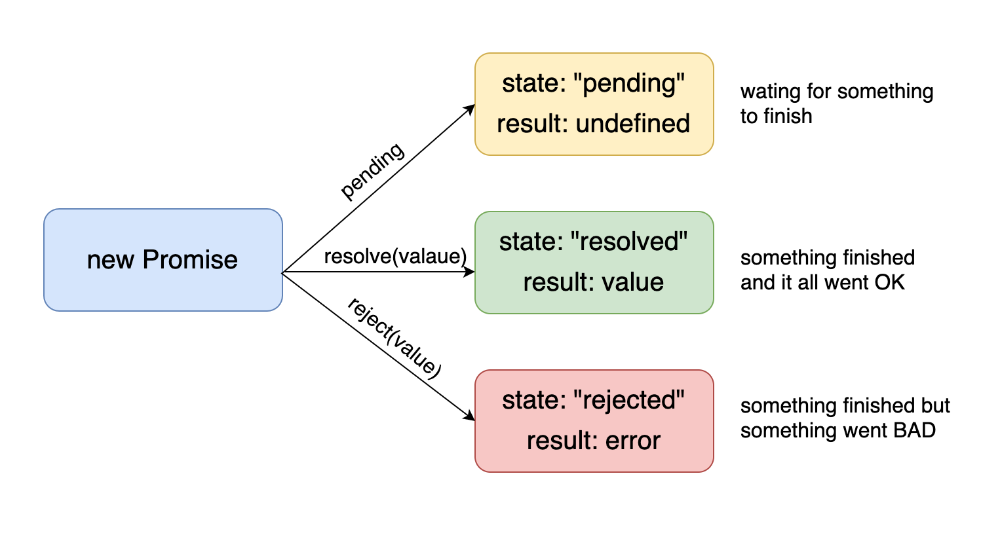
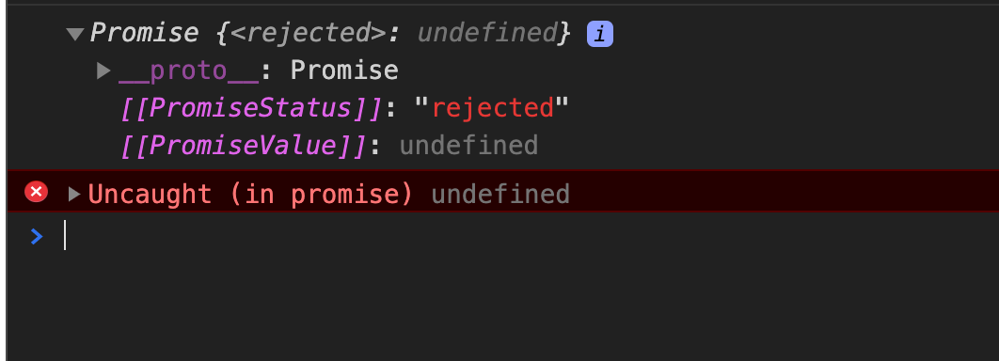
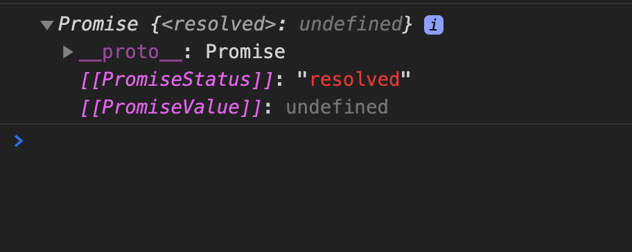
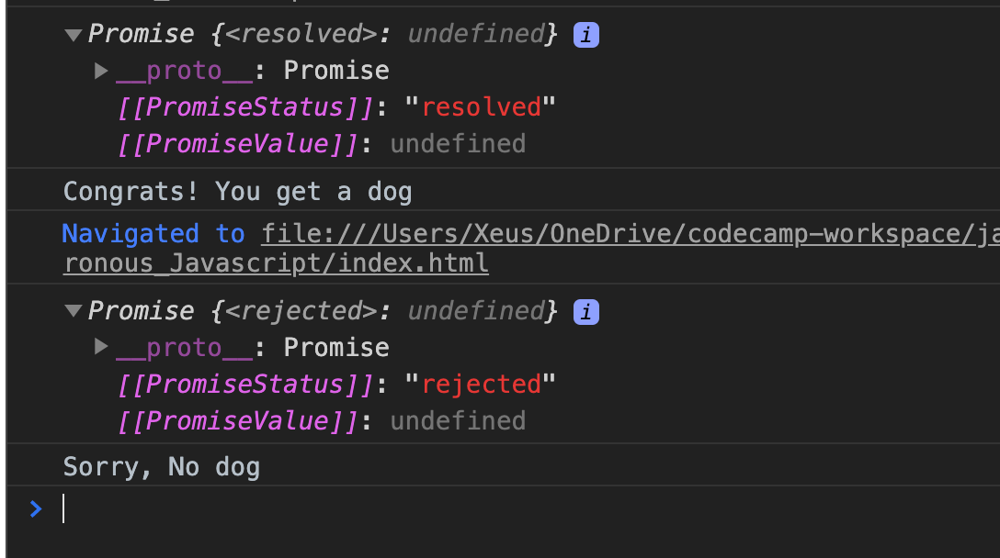
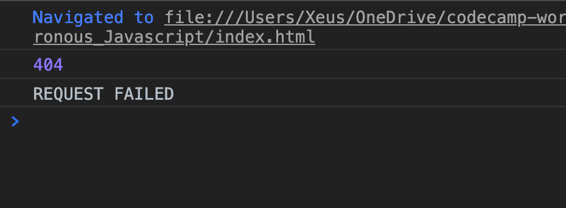
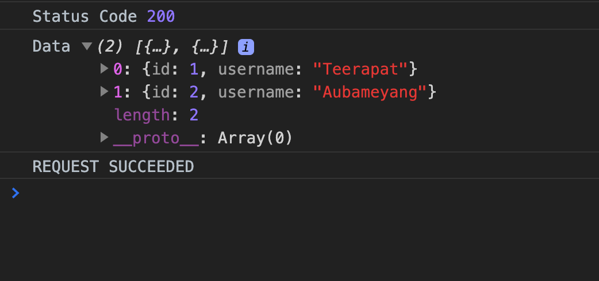
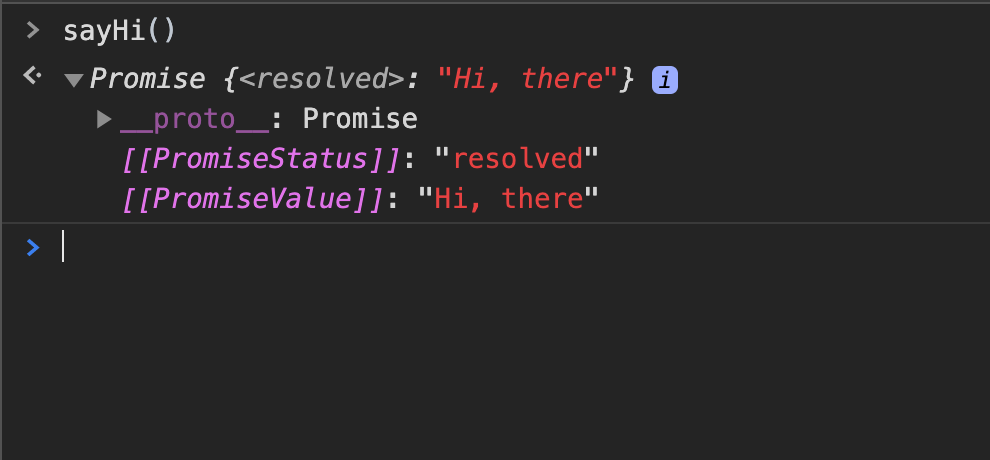
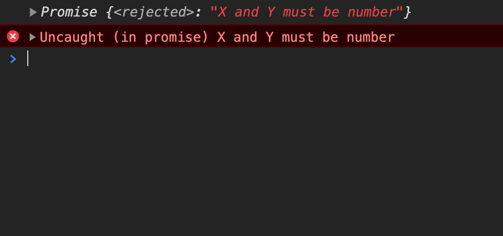

# Asynchronous Javascript

So, before we move on, we need to understand the javascript "call stack" works

## Call stack

> Call stacl is the mechanism of the Javascript interpreter uses to keep track of its place in a script that calls multiple functions. This is how JavaScript "knows" what functions are called from within that function, etc.

Stack is a data structure, think of stack of books on the desk. The last thing that you put on is going to be on the top and that will be the first thing that you remove. This is called "last in, first out".

### How call stack works

1. When a script calls a function, the interpreter adds it to the call stack and then starts carrying out the function.
2. Any functions that are called by that function are added to the call stack further up, and run where their calls are reached.
3. When the current function is finished, the interpreter takes it off the stack and resumes execution where it left off in the last code listing.

let's see some code example:

```javascript
const multiply = (x, y) => x * y;

const square = x => multiply(x, x);

const isRightTriangle = (a, b, c) => {
  return square(a) + square(b) === square(c);
};

isRightTriangle(3, 4, 5); // true
```

Here is steps by steps of what happened in a call stack:

1. The JavaScript interpreter found the very first function call `isRightTriangle(3, 4, 5)` and added to the call stack.
2. As you can see inside the `isRightTriangle()`, there are multiple functions calls in here `square()` and added to the call stack on top of `isRightTriangle()`.
3. `square()` still not return anything either, it calls an another function `multiply()`, so then `multiply()` is added to the call stack.

here what is look like:


So the last function `multiply()` doesn't call any other function, so it returns `3 * 3` which is `9` and when it returns a value it is remove from the stack. And then, `square(3)` return `9` so it's poped off the stack. Now, we end up with `isRightTriangle()` and javascript will do the same thing with `4` and `5`. Remember, "The last thing in is the first thing out".

here is another video explain about how call stack works in javascript.

[](https://www.youtube.com/watch?v=W8AeMrVtFLY)

## JavaScript is a single thread

"Javascript is a single thread" that's mean it can do one thing at that time. A line of code is executed, then the next one is executed, and so on.

let's see some code:

```javascript
console.log('I HAPPEN FIRST!');
alert('Hi!');
console.log('I HAPPEN SECOND!');
```

as you can see, `alert('Hi')` is blocking second console.log() the code won't run until you click OK



And that seems like it could be a severe limitation if we do things that take time if we do things that aren't immediate we don't want to just have a user sit there waiting and have no other code running.

Another example is network requests, imagine you want to request data from database or request data from third party API. That process are take time and it might give a bad user experience to waiting our webpage response.

Here is callbacks comes in to plays.

## Asynchronous Callbacks

To solves this problem, JavaScript using "Callbacks" let's see what does it means from MDN.

> Async callbacks are functions that are specified as arguments when calling a function which will start executing code in the background. When the background code finishes running, it calls the callback function to let you know the work is done, or to let you know that something of interest has happened.

For those processes that time, we pass a callback function and those functions will be executed at the appropriate time. Remember `alert()` as above? let's change something:

```javascript
console.log('I HAPPEN FIRST');
setTimeout(() => {
  alert('HI!');
}, 1000);
console.log('I HAPPEN SECOND!');
```



and this time, you will see `I HAPPEN FIRST` then `I HAPPEN SECOND` and `alert('HI!')`. because we've pass `alert('HI!')` into `setTimeout()` function.

As you can see, `setTimeout()` function takes 2 arguments, first is a callback function second is a delay time. When we pass a callback function as an argument to `setTimeout()` function, the callback function is not executed immediately. It is “called back” (hence the name) asynchronously somewhere inside the `setTimeout()` function’s body. The containing function is responsible for executing the callback function when the time comes (after 1 second delay).

Why does this work? It seems like it shouldn't look nothing different is really happening except we're passing in some function to be called later. How can javascript keep track of 1 second and remember to do this or call this function while also moving to another `console.log('I HAPPEN SECOND')`

The trick here is **"the browser does the work".** JavaScript is not the same as the browser. JavaScript is a language that is implemented in your browser. Those browser usually written in C++ and it capable of doing certain tasks that JavaScript sucks or take time. And when it's done, it reminds JavaScript Hey, your turn again.

To summarize:

- Browser come with "Web APIs" that are able to handle certain tasks in the background (like making requests or setTimeout)
- The JavaScript call stack recognizes these Web APIs functions and passes them off to the browser to take care of.
- Once the browser finishes those tasks, they return and are pushed onto the stack as a "Callback".

I recommended you to watch this awesome video about how asynchronous javascript actually works behind the scenes. Also play around with this [tools](http://latentflip.com/loupe/?code=JC5vbignYnV0dG9uJywgJ2NsaWNrJywgZnVuY3Rpb24gb25DbGljaygpIHsKICAgIHNldFRpbWVvdXQoZnVuY3Rpb24gdGltZXIoKSB7CiAgICAgICAgY29uc29sZS5sb2coJ1lvdSBjbGlja2VkIHRoZSBidXR0b24hJyk7ICAgIAogICAgfSwgMjAwMCk7Cn0pOwoKY29uc29sZS5sb2coIkhpISIpOwoKc2V0VGltZW91dChmdW5jdGlvbiB0aW1lb3V0KCkgewogICAgY29uc29sZS5sb2coIkNsaWNrIHRoZSBidXR0b24hIik7Cn0sIDUwMDApOwoKY29uc29sZS5sb2coIldlbGNvbWUgdG8gbG91cGUuIik7!!!PGJ1dHRvbj5DbGljayBtZSE8L2J1dHRvbj4%3D)

[](https://www.youtube.com/watch?v=8aGhZQkoFbQ)

## Promises

The main problem of using callbacks approach is that if we need to use the result of this function of the rest of our code, we must be nested inside the callback, and if we still have to do more callbacks we have to do with many levels of functions indented into other functions

```javascript
doSomething(result => {
  doSomethingElse(anotherResult => {
    doSomethingElseAgain(yetAnotherResult => {
      console.log(result);
    });
  });
});
```

We usually defined this nested callbacks functions as "Callback Hell".

### Promise come to resolve

Promise is an object representing the eventual completion or failure of an asynchronous operation or some task that takes time. Think like Promise is a way of promising a value that you may not have at the moment.

A Promise is a returned object to which you attach callbacks, instead of passing callbacks into a function



let's see some code:

```javascript
const willYouGetADog = new Promise((resolve, reject) => {});
```

Basically, there are 2 parameters, `resolve` and `reject` both are functions and if we check `willYouGetADog` we'll get:

```javascript
Promise { <pending> }
```

If we expanded Promise object, we'll see:

```javascript
[[PromiseStatus]]: 'pending'
[[PromiseValue]]: undefinded
```

If we are talking about this idea in the real world of a promise when someone promises you something we would say the status of that promise is pending until either they break the promise or they follow through on it. So if we don't reject or resolve a promise its value or its status will be `pending`.

What if we call `reject` on a Promise?

```javascript
const willYouGetADog = new Promise((resolve, reject) => {
  reject();
});
```

then we'll get an error `Uncaught (in promise)` and `PromiseStatus` is `'rejected'`



and if we instead `resolve`

```javascript
const willYouGetADog = new Promise((resolve, reject) => {
  resolve();
});
```



let's add more logic to our `Promise`

```javascript
const willYouGetADog = new Promise((resolve, reject) => {
  const grade = Math.round(Math.random() * 4);

  if (grade > 2.5) {
    resolve();
  } else {
    reject();
  }
});

// if grade > 2.5 Promise resolve
// if not Promise reject
```

The important way to interact with the Promise is using `Promise.then` when Promise is resolved and `Promise.catch` when Promise is rejected.

```javascript
const willYouGetADog = new Promise((resolve, reject) => {
  const grade = Math.round(Math.random() * 4);

  if (grade > 2.5) {
    resolve();
  } else {
    reject();
  }
});

console.log(willYouGetADog);

willYouGetADog
  .then(() => {
    console.log('Congrats! You get a dog');
  })
  .catch(() => {
    console.log('Sorry, No dog');
  });
```

here is what we get:



Returning Promise from Functions

```javascript
const makeDogPromise = () => {
  return new Promise((resolve, reject) => {
    const grade = Math.round(Math.random() * 4);

    if (grade > 2.5) {
      resolve();
    } else {
      reject();
    }
  });
};

makeDogPromise()
  .then(() => {
    console.log('Congrats! You get a dog');
  })
  .catch(() => {
    console.log('Sorry, No dog');
  });
```

### Resolving/Rejecting with values

The next thing to know about Promises is that when you reject or resolve a promise you can reject or resolve it with a value and you'll have access to that value in your callback that you pass into then or catch

```javascript
const fakeRequest = url => {
  return new Promise((resolve, reject) => {
    setTimeout(() => {
      const rand = Math.random();
      if (rand < 0.3) {
        reject({ status: 404 });
      } else {
        resolve();
      }
    }, 2000);
  });
};

fakeRequest()
  .then(() => {
    console.log('REQUEST SUCCEEDED');
  })
  .catch(response => {
    console.log(response.status);
    console.log('REQUEST FAILED');
  });
```

As you can see, if `rand < 0.3`. So our Promise weill be rejected and what we get back is:



we can pass access to the value that passed through reject function and we also can do the same when Promise is resolved.

```javascript
const fakeRequest = url => {
  return new Promise((resolve, reject) => {
    setTimeout(() => {
      const pages = {
        '/users': [
          { id: 1, username: 'Teerapat' },
          { id: 2, username: 'Aubameyang' }
        ]
      };

      const data = pages[url];
      if (data) {
        resolve({ status: 200, data });
      } else {
        reject({ status: 404 });
      }
    }, 2000);
  });
};

fakeRequest('/users')
  .then(response => {
    console.log('Status Code', response.status);
    console.log('Data', response.data);
    console.log('REQUEST SUCCEEDED');
  })
  .catch(response => {
    console.log(response.status);
    console.log('REQUEST FAILED');
  });
```

our `fakeRequest` function is check if `url` is not valid then return a promise with rejected

here is what we get:



and if `url` is not valid:

```javascript
fakeRequest('/userssssss')
  .then(response => {
    console.log('Status Code', response.status);
    console.log('Data', response.data);
    console.log('REQUEST SUCCEEDED');
  })
  .catch(response => {
    console.log(response.status);
    console.log('REQUEST FAILED');
  });
```


### Chaining multiple Promises

let's say, we have hard code API like this:

```javascript
const fakeRequest = url => {
  return new Promise((resolve, reject) => {
    setTimeout(() => {
      const pages = {
        '/users': [
          { id: 1, username: 'Bilbo' },
          { id: 5, username: 'Esmerelda' }
        ],
        '/users/1': {
          id: 1,
          username: 'Bilbo',
          upvotes: 360,
          city: 'Lisbon',
          topPostId: 454321
        },
        '/users/5': {
          id: 5,
          username: 'Esmerelda',
          upvotes: 571,
          city: 'Honolulu'
        },
        '/posts/454321': {
          id: 454321,
          title: 'Ladies & Gentlemen, may I introduce my pet pig, Hamlet'
        },
        '/about': 'This is the about page!'
      };
      const data = pages[url];
      if (data) {
        resolve({ status: 200, data }); //resolve with a value!
      } else {
        reject({ status: 404 }); //reject with a value!
      }
    }, 1000);
  });
};
```

We have different end point APIs, if we want to access data that we want to. We can do just that:

```javascript
fakeRequest('/users').then(response => {
  const id = response.data[0].id;
  // make request again to get data from user id 1
  fakeRequest(`/users/${id}`).then(response => {
    const postId = response.data.topPostId;
    // make request again to get data from postId 454321
    fakeRequest(`/posts/${postId}`).then(response => {
      console.log(response);
    });
  });
});
```

oh no... callback hell again... Luckily, we don't need nested callbacks as above, we need to return a promise and we can chain `.then` methods just like this

```javascript
fakeRequest('/users')
  .then(response => {
    const id = response.data[0].id;
    return fakeRequest(`/users/${id}`);
  })
  .then(response => {
    const postId = response.data.topPostId;
    return fakeRequest(`/posts/${postId}`);
  })
  .then(response => {
    console.log(response);
  })
  .catch(error => {
    console.log('OH NO!..', error);
  });
```

This look very much nicer, easy to read and understand.

## Async/Await

Async function always returns a Promise. If function return a value, the promise will be resolved with that value. If function throw an exception, the promise will be rejected.

### Async

```javascript
async function sayHi() {
  return 'Hi, there';
}

sayHi(); // returns Promise
```



so, then I can do just this:

```javascript
async function sayHi() {
  return 'Hi, there';
}

sayHi().then(value => console.log(value)); // 'Hi, there'
```

In case of `rejected`:

```javascript
async function add(x, y) {
  if (typeof x !== 'number' || typeof y !== 'number') {
    throw 'X and Y must be number';
  }
  return x + y;
}

add('e', 5);
```



and we can do `catch` method to capture an error

```javascript
async function add(x, y) {
  if (typeof x !== 'number' || typeof y !== 'number') {
    throw 'X and Y must be number';
  }
  return x + y;
}

add('e', 5)
  .then(value => {
    console.log(value);
  })
  .catch(error => console.log(err)); // X and Y must be number
```

As you can see, `async` is easier than previous syntax `new Promise`. Let's see how to use with `await` keyword.

### Await

We can only use `await` keyword inside of function declared with `async` keyword. `await` will pause the execution of the function, waiting for `Promise` to be resolved. we can run code after an asynchronous operation without having to mess things with callbacks.

```javascript
function resolveAfter2Seconds() {
  return new Promise(resolve => {
    setTimeout(() => {
      resolve('resolved');
    }, 2000);
  });
}

async function asyncCall() {
  console.log('calling');
  const result = await resolveAfter2Seconds();
  console.log(result); // 'calling' and 'resolved'
}

asyncCall();
```

So, we don't have to use `.then()` method. With `await` keyword, it will wait until `Promise` is resolved (in this case is after 2 seconds). Then we can store in variable `result` and logging in the console.

### Error Handling in Async Function

Basically, we use `try catch`

```javascript
function resolveAfter2Seconds() {
  return new Promise((resolve, reject) => {
    setTimeout(() => {
      reject('reject');
    }, 2000);
  });
}

async function asyncCall() {
  try {
    console.log('calling');
    const result = await resolveAfter2Seconds();
    console.log(result);
  } catch (err) {
    consol.log('In catch with ', err);
  }
}

asyncCall(); // calling and In catch with  reject
```

### Handling multiple Awaits

```javascript
const setTimeoutAndLog = async input => {
  return new Promise((resolve, reject) => {
    setTimeout(() => {
      console.log(input);
      resolve();
    }, 1000);
  });
};

const runTimer = async () => {
  try {
    await setTimeoutAndLog('a');
    await setTimeoutAndLog('b');
    await setTimeoutAndLog('c');
  } catch (error) {
    console.log(error);
  }
};
runTimer(); // log 'a', 'b', 'c', 'd' every second respectively
```

## Promise.all

`Promise.all()` is actually a promise that takes an array of promises as an input (an iterable). Then it gets resolved when all the promises get resolved or any one of them gets rejected.

```javascript
const p1 = Promise.resolve(3);
const p2 = 1337;
const p3 = new Promise((resolve, reject) => {
  setTimeout(() => {
    resolve('foo');
  }, 100);
});

Promise.all([p1, p2, p3]).then(values => {
  console.log(values); // [3, 1337, "foo"]
});
```
