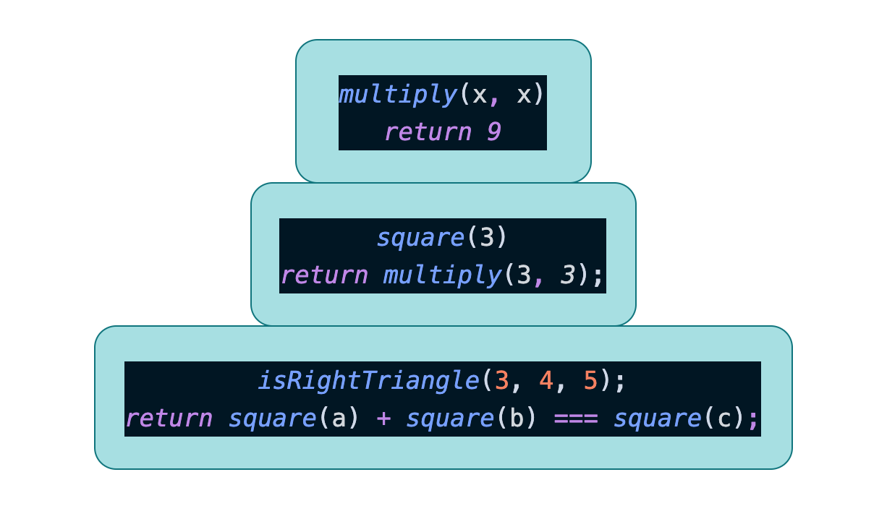

# Asynchronous Javascript

"Javascript is a single thread" that's mean it can do one thing at a time. A line of code is executed, then the next one is executed, and so on. However, sometimes we just can't wait for big file to finish download and stop the program running or we just can't wait for network requests finish before doing something else.

So, before we move on, we need to understand the javascript "call stack" works

## Call stack

> Call stacl is the mechanism of the Javascript interpreter uses to keep track of its place in a script that calls multiple functions. This is how JavaScript "knows" what functions are called from within that function, etc.

Stack is a data structure, think of stack of books on the desk. The last thing that you put on is going to be on the top and that will be the first thing that you remove. This is called "last in, first out".

### How call stack works

1. When a script calls a function, the interpreter adds it to the call stack and then starts carrying out the function.
2. Any functions that are called by that function are added to the call stack further up, and run where their calls are reached.
3. When the current function is finished, the interpreter takes it off the stack and resumes execution where it left off in the last code listing.

let's see some code example:

```javascript
const multiply = (x, y) => x * y;

const square = x => multiply(x, x);

const isRightTriangle = (a, b, c) => {
  return square(a) + square(b) === square(c);
};

isRightTriangle(3, 4, 5); // true
```

Here is steps by steps of what happened in a call stack:

1. The JavaScript interpreter found the very first function call `isRightTriangle(3, 4, 5)` and added to the call stack.
2. As you can see inside the `isRightTriangle()`, there are multiple functions calls in here `square()` and added to the call stack on top of `isRightTriangle()`.
3. `square()` still not return anything either, it calls an another function `multiply()`, so then `multiply()` is added to the call stack.

here what is look like:



So the last function `multiply()` doesn't call any other function, so it returns `3 * 3` which is `9` and when it returns a value it is remove from the stack. And then, `square(3)` return `9` so it's poped off the stack. Now, we end up with `isRightTriangle()` and javascript will do the same thing with `4` and `5`. Remember, "The last thing in is the first thing out".

<iframe width="560" height="315" src="https://www.youtube.com/embed/W8AeMrVtFLY" frameborder="0" allow="accelerometer; autoplay; encrypted-media; gyroscope; picture-in-picture" allowfullscreen></iframe> "The JS Call Stack Explained In 9 Minutes"
